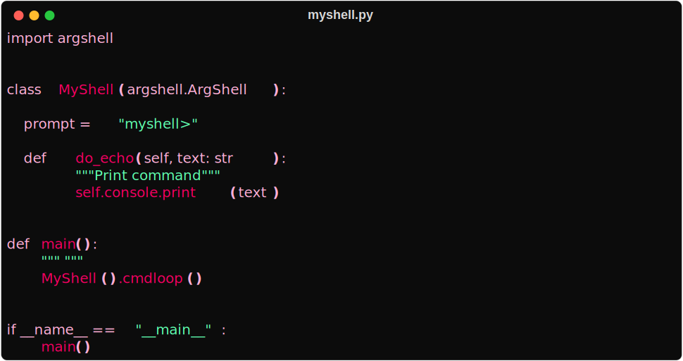
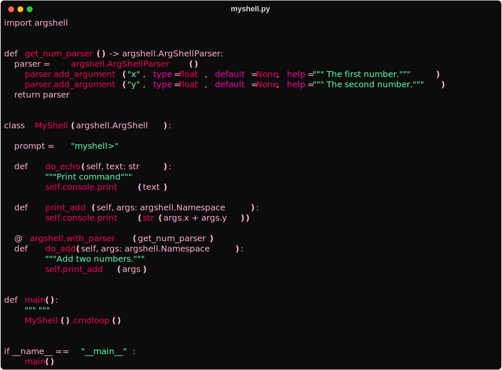
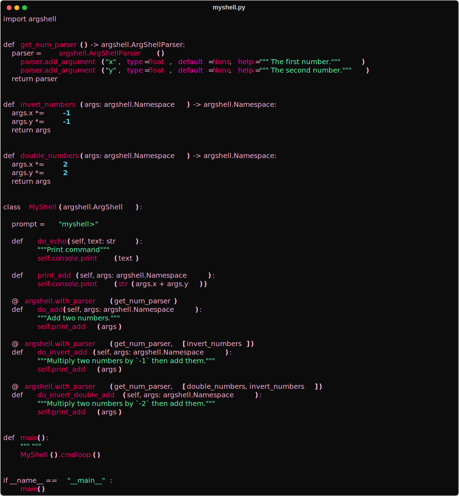
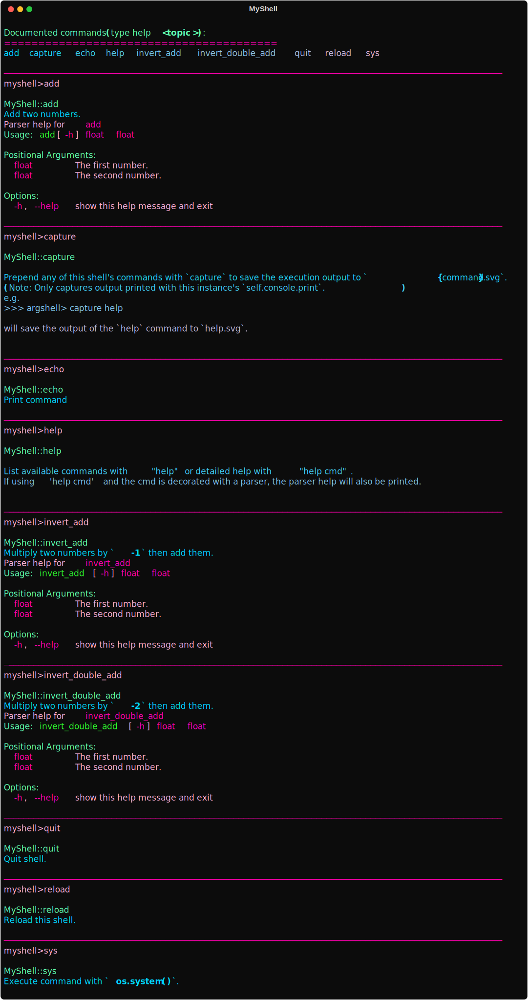

# argshell

Integrates the argparse and cmd modules to create custom shells with argparse functionality. 

## Installation

Install with:

<pre>
pip install argshell
</pre>

## Usage

Custom shells are created by subclassing the ArgShell class and adding functions of the form `do_*()`, just like the cmd.Cmd class.  
The `ArgShell` class contains a `rich.console.Console` object that can be used to print renderables.  

In terminal:

---

Rather than being limited to input strings, you can use `argparse` style parsers for shell commands.  
Create a function that instantiates an `ArgShellParser` instance, adds arguments, and then returns the `ArgShellParser` object.  
Then you can can decorate `do_*` functions using `with_parser()` to pass a `Namespace` object instead of a string.

In terminal:

---

The `with_parser` function also accepts an optional list of functions that accept and return an `argshell.Namespace` object.  
These functions will be executed in order after the parser function parses the arguments.

In terminal:

--- 

When using your shell, entering `help command` will, in addition to the command's doc string,
print the help message of the parser that decorates it, if it is decorated.  

---

The `capture` command can be used to save an svg of another command's output by prepending to a command.  
(NOTE: This only works for output printed with `ArgShell`'s `console` member mentioned earlier.)
The following would create a file called `add.svg` in your current directory:

The saved svg:

---

There's also a "hidden" command for generating documentation called `shell_docs`.

Executing that command for `MyShell`:
